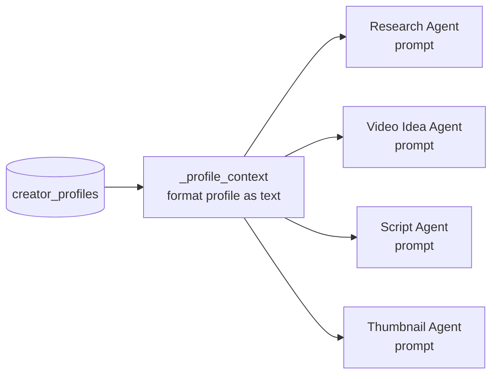
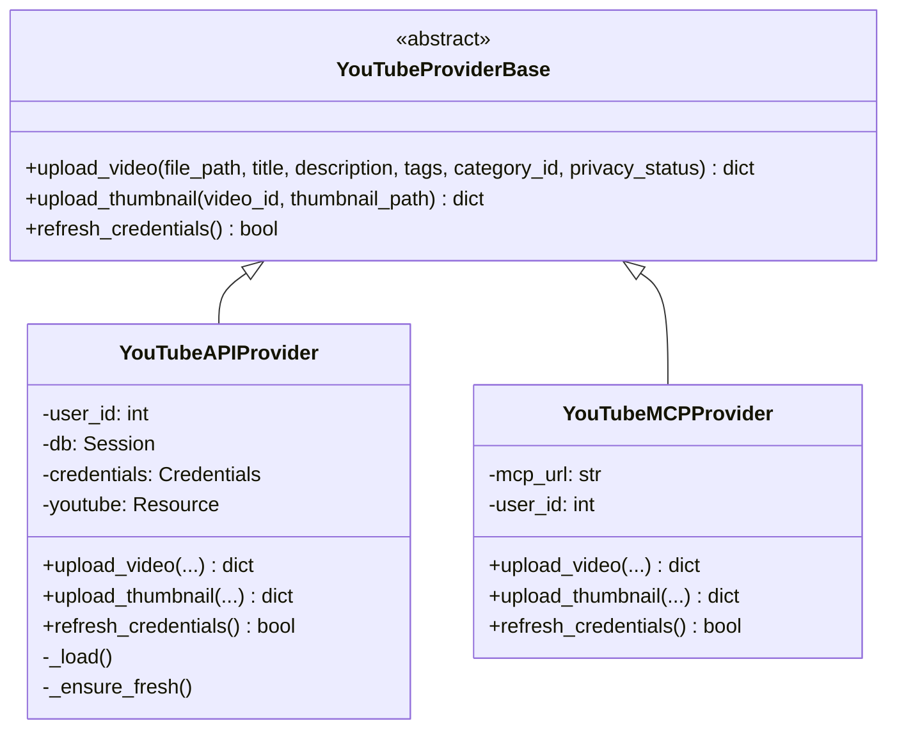

# Architecture

AI Content Studio is built around three core principles: **agent-based personalization**, **stateful human-in-the-loop workflows**, and **provider abstraction** for external services.

---

## System Architecture

```mermaid
graph TB
    subgraph Clients
        Browser[Browser / Swagger UI]
        Frontend[React Frontend]
    end

    subgraph FastAPI["FastAPI Application"]
        direction TB
        MW[Middleware\nCORS · Session · BearerAuth]
        R_Auth[/auth]
        R_YT[/youtube]
        R_CP[/creator-profile]
        R_WF[/workflow]
    end

    subgraph LangGraph["LangGraph Orchestration Layer"]
        CGW[Content Generation Workflow\nStateful · HITL · PostgreSQL checkpointed]
        UPW[Upload Workflow\nSEO · Metadata · YouTube publish]
        CPW[Creator Profile Workflow\nChannel analysis · Profile generation]
    end

    subgraph Agents
        RA[Research Agent]
        VIA[Video Idea Agent]
        SA[Script Agent]
        TA[Thumbnail Agent]
        CPA[Creator Profile Agent]
    end

    subgraph LLM["LLM Layer — Qwen via DashScope"]
        QPlus[qwen-plus\nIdeas · SEO · Thumbnail]
        QMax[qwen-max\nResearch · Scripts — Plus plan only]
    end

    subgraph Storage["PostgreSQL 16"]
        T_Users[(users)]
        T_Profiles[(creator_profiles)]
        T_Videos[(youtube_videos)]
        T_Accounts[(youtube_accounts)]
        T_Gens[(generations)]
        T_Uploads[(upload_records)]
        T_Check[(langgraph_checkpoints\n+ blobs + writes)]
    end

    subgraph YouTube["YouTube"]
        YTAPI[Data API v3]
    end

    Clients --> FastAPI
    FastAPI --> LangGraph
    LangGraph --> Agents
    Agents --> LLM
    LangGraph --> Storage
    FastAPI --> Storage
    LangGraph --> YouTube
```

---

## Backend Architecture

The backend follows a layered architecture. Each layer has a single responsibility and calls only the layer below it.

```
routes/          → HTTP handlers. Validate input. Call graph or service.
graph/           → LangGraph workflow definitions. Orchestrate agents.
agents/          → Stateless functions that call the LLM with a prompt.
services/        → Database read/write operations. No HTTP, no LLM.
models/          → SQLAlchemy ORM models. No business logic.
youtube_provider/→ YouTube upload abstraction. No LangGraph dependency.
core/            → Auth utilities, exceptions. No database dependency.
```

Routes never call agents directly. Routes invoke a LangGraph graph, which calls agents as nodes. This keeps HTTP concerns separate from agentic logic.

---

## Agent Architecture

All content agents share the same structure:

```python
def agent_name(
    topic: str,
    previous_output: str,
    plan: str = "normal",
    creator_profile: dict = {},
) -> str | list:
    profile_ctx = _profile_context(creator_profile)  # personalization layer
    prompt = build_prompt(profile_ctx, topic, ...)
    model = get_model(plan, "task_name")              # model routing
    return generate_response(prompt, model)           # LLM call
```

The `_profile_context()` function in `research_agent.py` is the shared personalization layer. It converts the creator profile dict into a compact context string injected into every agent prompt. This is the mechanism that makes output personalized — every agent knows the creator's niche, audience level, title style, and viral patterns.



---

## LangGraph Architecture

LangGraph manages workflow state as a `TypedDict` that flows through nodes. Each node is a Python function that receives state and returns a partial state update.

### Key LangGraph concepts used

**`interrupt()`** — pauses the graph at a node and surfaces data to the caller. Used at `human_approval` and `idea_selection` in the content workflow, and `review_metadata` in the upload workflow.

**`Command(resume=value)`** — resumes a paused graph by injecting the user's response into the interrupted node's return value.

**PostgresSaver** — stores all checkpoint state (current node, full state dict, pending writes) in PostgreSQL tables. This is why HITL state survives server restarts.

**Singleton pattern** — each workflow module checks `sys.modules[__name__]` before building the graph. This prevents the graph from being rebuilt on every uvicorn `--reload`, which would lose in-memory MemorySaver state during development.

### State flow

```
POST /workflow/run
  → graph.invoke({topic, user_id, generation_id, plan})
  → load_profile_node() → research_node() → human_approval_node()
  → interrupt() ← graph pauses here, returns to caller

POST /workflow/resume {"approved": true}
  → graph.invoke(Command(resume=True))
  → idea_node() → idea_selection_node()
  → interrupt() ← graph pauses again

POST /workflow/select-idea {"selected_idea": "..."}
  → graph.invoke(Command(resume="idea text"))
  → script_node() → thumbnail_node() → save_generation_node()
  → graph completes
```

---

## Provider Architecture

The YouTube upload provider is abstracted behind an interface so the workflow doesn't depend on any specific implementation.



The factory function `get_youtube_provider(user_id, db)` picks the right implementation:
- If `YOUTUBE_MCP_URL` is set in `.env` → `YouTubeMCPProvider`
- Otherwise → `YouTubeAPIProvider`

The upload workflow nodes call `get_youtube_provider()` and never import either implementation directly.

---

## Database Architecture

See [database_schema.md](database_schema.md) for full table documentation.

The database serves three distinct purposes:

**Application data** — `users`, `creator_profiles`, `youtube_accounts`, `youtube_videos`, `generations`, `upload_records`. Managed by the application through SQLAlchemy.

**LangGraph checkpointing** — `langgraph_checkpoints`, `langgraph_checkpoint_blobs`, `langgraph_checkpoint_writes`. Managed entirely by LangGraph's `PostgresSaver`. Never touch these manually.

**Relationship summary:**
```
users
  ├── creator_profiles (one per user)
  ├── youtube_accounts (one per user)
  ├── youtube_videos   (many per user)
  ├── generations      (many per user)
  └── upload_records   (many per user, FK to generations)
```

---

## Future MCP Architecture

See [mcp_integration.md](mcp_integration.md) for the full MCP roadmap.

The current provider abstraction was designed with MCP in mind. When a YouTube MCP server becomes available, activating it requires only setting `YOUTUBE_MCP_URL` in `.env` — no code changes.

The same pattern will be used for future integrations: MongoDB MCP for document storage, Google Drive MCP for asset management, and Slack MCP for notifications.
