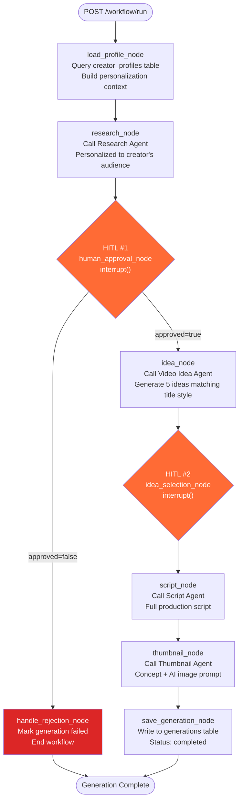

# Content Generation Workflow

The content generation workflow is the core pipeline of AI Content Studio. It takes a topic and a user's creator profile, runs six LangGraph nodes, and produces a complete research report, a shortlist of video ideas, a full production script, and a thumbnail concept — all personalized to the specific creator.

---

## Graph



---

## State Schema

The workflow carries an `AgentState` TypedDict through all nodes. Each node receives the full state and returns only the fields it updates.

```python
class AgentState(TypedDict, total=False):
    topic: str              # User's input — the video topic
    plan: str               # "normal" | "pro" | "plus" — controls model selection
    user_id: int            # Authenticated user — used to load creator profile
    creator_profile: dict   # Loaded from DB at start — personalization context
    generation_id: int      # DB record ID — created at /workflow/run, updated throughout

    # Pipeline outputs (accumulated across nodes)
    research: str           # Research Agent output
    ideas: list[str]        # 5 video ideas from Video Idea Agent
    selected_idea: str      # User's choice from idea_selection HITL
    script: str             # Full script from Script Agent
    thumbnail: str          # Thumbnail concept + AI prompt from Thumbnail Agent

    # HITL
    human_approved: Optional[bool]  # Set by human_approval_node after interrupt()
```

---

## Nodes

### `load_profile_node`

**Purpose:** Load the creator's profile from `creator_profiles` table and convert it into a context string that all subsequent agents inject into their prompts.

**Input from state:** `user_id`

**Output to state:** `creator_profile` (dict)

**Behavior:** If no profile exists for the user (they haven't run `/creator-profile/generate` yet), returns an empty dict. All agents handle empty profiles gracefully by falling back to generic output.

**Why it runs first:** The personalization context must be available before any LLM call. Running it as the first node ensures all downstream agents receive the same profile snapshot for this run.

---

### `research_node`

**Purpose:** Research the given topic from the perspective of this creator's specific audience.

**Input from state:** `topic`, `plan`, `creator_profile`

**Output to state:** `research` (str)

**Side effect:** Immediately writes `research` to the `generations` table via `save_research()`. This persists the research even if the user rejects the workflow at the next HITL step, preserving the LLM output for audit purposes.

**Personalization:** The Research Agent injects the creator profile context into its prompt. A beginner Python channel gets research focused on foundational learning pain points. A finance channel gets research on professional investment strategies.

---

### `human_approval_node` *(HITL #1)*

**Purpose:** Pause the workflow and surface the research output to the user for review.

**Mechanism:** Calls `interrupt("Research complete. Approve to continue.")`. LangGraph serializes the full workflow state to the PostgreSQL checkpointer and returns control to the caller.

**Resume via:** `POST /workflow/resume {"thread_id": "...", "approved": true/false}`

**On approval:** Graph continues to `idea_node`.

**On rejection:** Graph routes to `handle_rejection_node`, which marks the generation as `failed` in the DB.

**Why this matters:** Research is the most expensive LLM call. Giving the user a chance to review before generating 5 ideas + a full script prevents wasted quota on topics that went in the wrong direction.

---

### `idea_node`

**Purpose:** Generate exactly 5 video ideas that match the creator's title style and are personalized to their audience.

**Input from state:** `topic`, `research`, `plan`, `creator_profile`

**Output to state:** `ideas` (list of strings)

**Output format:** JSON array of 5 strings. Each string is a complete video title + one sentence description. Falls back to line-by-line parsing if JSON fails, then raw string as last resort.

**Personalization:** Extracts `title_style` from the creator profile and includes it directly in the prompt: *"Match their title style: 'neutral and aspirational'"*. Ideas will pattern-match the creator's existing videos.

---

### `idea_selection_node` *(HITL #2)*

**Purpose:** Present the 5 ideas to the user and let them pick one before the expensive script generation begins.

**Mechanism:** Calls `interrupt({"type": "idea_selection", "ideas": [...]})`. The ideas list is embedded in the interrupt payload so the caller receives them in the paused response.

**Resume via:** `POST /workflow/select-idea {"thread_id": "...", "selected_idea": "idea text"}`

**Why this matters:** Script generation is the longest and most expensive node. The user must explicitly choose which direction to take before committing.

---

### `script_node`

**Purpose:** Write a complete, production-ready YouTube script for the selected idea.

**Input from state:** `topic`, `research`, `selected_idea`, `plan`, `creator_profile`

**Output to state:** `script` (str)

**Structure generated:**
```
# Hook
# Introduction
# Main Content
# Conclusion
# Call To Action
```

**Personalization:** Extracts `audience_type`, `audience_level`, and `description_style.tone` from the creator profile. A beginner-level channel gets simple vocabulary and step-by-step structure. An advanced channel gets technical depth and professional tone.

---

### `thumbnail_node`

**Purpose:** Generate a thumbnail concept and AI image generation prompt tailored to the creator's brand.

**Input from state:** `topic`, `script`, `plan`, `creator_profile`

**Output to state:** `thumbnail` (str, markdown format)

**Output sections:**
1. **Thumbnail Text** — short, punchy overlay text
2. **Thumbnail Concept** — visual description of the scene
3. **Emotion** — the psychological trigger for clicks
4. **Color Suggestions** — brand-appropriate palette
5. **Thumbnail Prompt** — ready-to-use prompt for Imagen, DALL-E, or Midjourney

**Personalization:** Uses `viral_patterns` from the creator profile to match what has historically performed well on their channel.

---

### `save_generation_node`

**Purpose:** Persist all workflow outputs to the `generations` table and mark status as `completed`.

**Input from state:** `generation_id`, `ideas`, `selected_idea`, `script`, `thumbnail`, `creator_profile`

**Side effect:** Updates the `generations` row (created at `/workflow/run` start) with all fields. Passes `seo=""` intentionally — SEO is the upload workflow's responsibility, not the content workflow's.

**On error:** Catches exceptions, calls `fail_generation()` to mark the record as failed, and prints the error. Does not re-raise — a save failure shouldn't crash the workflow after all the expensive LLM work is done.

---

## API Flow

### Start workflow

```http
POST /workflow/run
Authorization: Bearer <token>

{
  "topic": "How to learn Python fast",
  "plan": "normal"
}
```

Response:
```json
{
  "thread_id": "3148668b-...",
  "generation_id": 1,
  "status": "awaiting_approval",
  "paused_at": "human_approval",
  "research": "..."
}
```

### Approve research (HITL #1)

```http
POST /workflow/resume
Authorization: Bearer <token>

{
  "thread_id": "3148668b-...",
  "approved": true
}
```

Response:
```json
{
  "status": "awaiting_idea_selection",
  "ideas": [
    "Learn Python Like You're Learning Spanish — ...",
    "The 5-Minute Python Reset — ...",
    ...
  ]
}
```

### Select an idea (HITL #2)

```http
POST /workflow/select-idea
Authorization: Bearer <token>

{
  "thread_id": "3148668b-...",
  "selected_idea": "The 5-Minute Python Reset - ..."
}
```

Response:
```json
{
  "generation_id": 1,
  "status": "completed",
  "script": "# Hook\n...",
  "thumbnail": "## Thumbnail Text\n...",
  "selected_idea": "..."
}
```

---

## HITL Checkpoint Persistence

All HITL state is stored in PostgreSQL via LangGraph's `PostgresSaver`. This means:

- A user can start a workflow, close their browser, and resume hours later
- Server restarts do not lose paused workflows
- Multiple uvicorn workers all share the same checkpoint state

The `thread_id` returned at `/workflow/run` is the permanent identifier for the checkpoint. Store it in the frontend to enable resumption.
