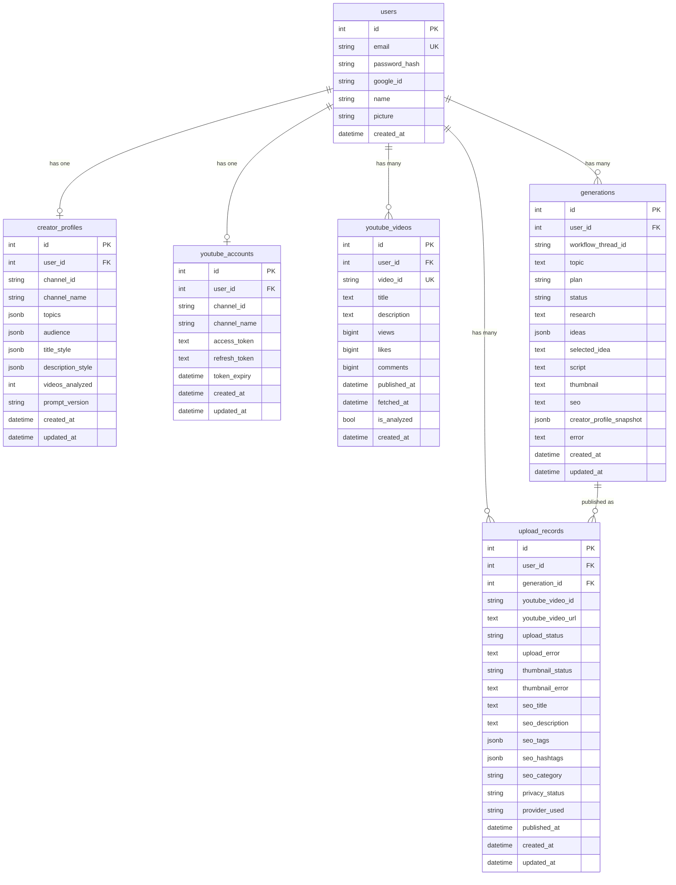

# Database Schema

AI Content Studio uses a single PostgreSQL database with two categories of tables: **application tables** (managed by the application) and **checkpoint tables** (managed by LangGraph).

---

## Entity Relationship Diagram



---

## Table Reference

### `users`

The root table. Every other table links back to a user.

| Column | Type | Notes |
|--------|------|-------|
| `id` | INTEGER PK | Auto-increment |
| `email` | VARCHAR UNIQUE | Used as JWT subject (`sub`) |
| `password_hash` | VARCHAR nullable | Null for Google OAuth users |
| `google_id` | VARCHAR nullable | Null for email/password users |
| `name` | VARCHAR | Display name |
| `picture` | VARCHAR | Profile picture URL from Google |
| `created_at` | TIMESTAMP | UTC |

**Why it exists:** Central identity table. Supports both email/password and Google OAuth login. The email is the stable identifier — `google_id` is only used during OAuth callback to prevent duplicate accounts.

---

### `creator_profiles`

One row per user. Stores the LLM-generated analysis of the user's YouTube channel. This is the personalization engine — every content agent reads from this table.

| Column | Type | Notes |
|--------|------|-------|
| `id` | INTEGER PK | |
| `user_id` | INTEGER FK → users.id | CASCADE delete |
| `channel_id` | VARCHAR | YouTube channel ID |
| `channel_name` | VARCHAR | Display name |
| `topics` | JSONB | List of main content topics |
| `audience` | JSONB | `{audience_type, audience_level}` |
| `title_style` | JSONB | `{style: "neutral and aspirational"}` |
| `description_style` | JSONB | `{style: "minimal"}` |
| `videos_analyzed` | INTEGER | Sample size used for profile |
| `prompt_version` | VARCHAR | e.g. `"v1"` — bump when prompt changes |
| `created_at` | TIMESTAMPTZ | |
| `updated_at` | TIMESTAMPTZ | Auto-updated on change |

**Why JSONB for topics/audience/style:** These fields evolve as the LLM prompt is improved. JSONB allows schema evolution without migrations.

**`prompt_version`:** When the creator profile prompt changes, existing profiles become stale. The version field lets you query which profiles need regeneration: `WHERE prompt_version != 'v2'`.

---

### `youtube_accounts`

Stores OAuth tokens for the user's connected YouTube channel. One account per user (unique constraint on `user_id`).

| Column | Type | Notes |
|--------|------|-------|
| `id` | INTEGER PK | |
| `user_id` | INTEGER FK → users.id | UNIQUE — one channel per user |
| `channel_id` | VARCHAR | YouTube channel ID |
| `channel_name` | VARCHAR | Display name |
| `access_token` | TEXT | Short-lived (1 hour) |
| `refresh_token` | TEXT | Long-lived — used to get new access tokens |
| `token_expiry` | TIMESTAMP | Naive UTC — required by google-auth library |
| `created_at` | TIMESTAMP | |
| `updated_at` | TIMESTAMP | Auto-updated on token refresh |

**Security note:** In production, `access_token` and `refresh_token` should be encrypted at rest using pgcrypto or application-level encryption. This is marked as a future task in the roadmap.

**`token_expiry` is naive UTC:** The google-auth library compares expiry using `utcnow()` (naive). Storing a timezone-aware datetime causes a `TypeError`. This is an intentional design decision, not an oversight.

---

### `youtube_videos`

Stores raw video data fetched from the YouTube Data API. Populated by `POST /youtube/research`.

| Column | Type | Notes |
|--------|------|-------|
| `id` | INTEGER PK | |
| `user_id` | INTEGER FK → users.id | CASCADE delete |
| `video_id` | VARCHAR UNIQUE | YouTube's own video ID (e.g. `dQw4w9WgXcQ`) |
| `title` | TEXT | |
| `description` | TEXT | |
| `views` | BIGINT | |
| `likes` | BIGINT | |
| `comments` | BIGINT | |
| `published_at` | TIMESTAMP | Original publish date |
| `fetched_at` | TIMESTAMPTZ | When we fetched this row |
| `is_analyzed` | BOOLEAN | True after CreatorProfileAgent processes it |
| `created_at` | TIMESTAMP | |

**`video_id` UNIQUE constraint:** Prevents duplicate rows on re-fetch. The upsert in `YouTubeResearchAgent` uses `ON CONFLICT DO UPDATE` to refresh stats without creating duplicates.

**`is_analyzed`:** Flipped to `True` after `CreatorProfileAgent` processes the video. Enables incremental analysis — future runs only process new videos.

**`fetched_at`:** Enables incremental sync. A future version of `YouTubeResearchAgent` can query `WHERE fetched_at < NOW() - INTERVAL '24 hours'` to only re-fetch stale videos.

---

### `generations`

One row per content generation workflow run. Created at `POST /workflow/run` as `pending`, updated progressively as the workflow runs, completed at `save_generation_node`.

| Column | Type | Notes |
|--------|------|-------|
| `id` | INTEGER PK | |
| `user_id` | INTEGER FK → users.id | CASCADE delete |
| `workflow_thread_id` | VARCHAR | LangGraph thread ID — links to checkpoint |
| `topic` | TEXT | User's input |
| `plan` | VARCHAR | `"normal"` \| `"pro"` \| `"plus"` |
| `status` | VARCHAR | `"pending"` → `"completed"` \| `"failed"` |
| `research` | TEXT | Research Agent output |
| `ideas` | JSONB | List of 5 video idea strings |
| `selected_idea` | TEXT | User's chosen idea |
| `script` | TEXT | Full production script |
| `thumbnail` | TEXT | Thumbnail concept + AI prompt |
| `seo` | TEXT | Intentionally empty (SEO is upload workflow's job) |
| `creator_profile_snapshot` | JSONB | Profile at generation time |
| `error` | TEXT | Set if status == `"failed"` |
| `created_at` | TIMESTAMPTZ | |
| `updated_at` | TIMESTAMPTZ | |

**`workflow_thread_id`:** The LangGraph thread ID used to resume HITL workflows. Also used by `get_generation_by_workflow_thread()` to look up the record after workflow completion.

**`creator_profile_snapshot`:** A copy of the creator profile dict at the time this generation ran. Stored so history is accurate — if the user regenerates their profile later, old generations still show what profile drove them.

**`seo` column:** Exists in the schema but is always empty. It's preserved for backward compatibility. All SEO data for published videos is in `upload_records`.

---

### `upload_records`

One row per upload attempt. Created by `save_upload_result_node` after every upload workflow run — including failures and cancellations.

| Column | Type | Notes |
|--------|------|-------|
| `id` | INTEGER PK | |
| `user_id` | INTEGER FK → users.id | CASCADE delete |
| `generation_id` | INTEGER FK → generations.id | SET NULL on generation delete |
| `youtube_video_id` | VARCHAR nullable | Empty if upload failed or demo mode |
| `youtube_video_url` | TEXT nullable | `https://youtube.com/watch?v=...` |
| `upload_status` | VARCHAR | `"pending"` → `"uploaded"` \| `"failed"` \| `"cancelled"` \| `"metadata_ready"` |
| `upload_error` | TEXT | Set on failure |
| `thumbnail_status` | VARCHAR | `"uploaded"` \| `"failed"` \| `"skipped"` |
| `thumbnail_error` | TEXT | Set on thumbnail failure |
| `seo_title` | TEXT | Snapshot of title used at publish time |
| `seo_description` | TEXT | Snapshot of description |
| `seo_tags` | JSONB | Snapshot of tags list |
| `seo_hashtags` | JSONB | Snapshot of hashtags list |
| `seo_category` | VARCHAR | e.g. `"Education"` |
| `privacy_status` | VARCHAR | `"private"` \| `"unlisted"` \| `"public"` |
| `provider_used` | VARCHAR | `"api"` \| `"mcp"` |
| `published_at` | TIMESTAMPTZ | Set on successful upload |
| `created_at` | TIMESTAMPTZ | |
| `updated_at` | TIMESTAMPTZ | |

**SEO fields are snapshots:** The title/description/tags stored here reflect exactly what was uploaded to YouTube. If the user runs the upload workflow again with different SEO, a new row is created — the old record is untouched.

**`provider_used`:** Tracks whether the YouTube Data API or MCP server was used. Useful for debugging and for understanding which uploads happened before and after MCP activation.

---

## LangGraph Checkpoint Tables

These three tables are created and managed entirely by LangGraph's `PostgresSaver`. Never modify them manually.

| Table | Purpose |
|---|---|
| `langgraph_checkpoints` | Current state of each workflow thread |
| `langgraph_checkpoint_blobs` | Serialized state blobs (handles large state dicts) |
| `langgraph_checkpoint_writes` | Pending writes between node executions |

The `thread_id` in these tables corresponds to the `workflow_thread_id` in `generations` and the upload thread IDs returned by `/workflow/upload/start`.

---

## Migration

The project uses `migrate.py` for schema changes during development. It drops and recreates the affected tables rather than using incremental ALTER TABLE statements.

```bash
python migrate.py
```

This is safe because no production data exists during development. For production, switch to Alembic: `alembic revision --autogenerate -m "description"`.
