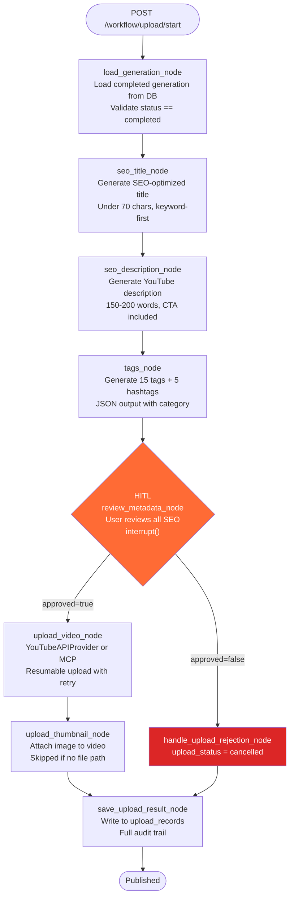

# Upload Workflow

The upload workflow is a separate LangGraph pipeline that runs **after** content generation is complete. It takes a finished generation (script + thumbnail concept) and produces SEO metadata, uploads the video to YouTube, attaches a thumbnail, and saves a full audit record.

SEO generation lives here — not in the content workflow. This separation means creators can generate content at any time and decide when and how to publish it.

---

## Graph



---

## State Schema

```python
class UploadState(TypedDict, total=False):
    # Inputs
    generation_id: int          # ID of the completed generation to publish
    user_id: int                # Authenticated user
    plan: str                   # Model tier
    video_file_path: str        # Absolute path to .mp4/.mov (optional — demo mode if omitted)
    thumbnail_file_path: str    # Absolute path to .jpg/.png (optional)

    # Loaded from generation record
    topic: str
    script: str
    thumbnail: str              # Text concept from content workflow

    # SEO outputs (generated by this workflow)
    seo_title: str
    seo_description: str
    seo_tags: list[str]         # 15 tags
    seo_hashtags: list[str]     # 5 hashtags
    seo_category: str           # e.g. "Education"

    # Upload config
    privacy_status: str         # "private" | "unlisted" | "public"
    scheduled_at: Optional[str] # ISO datetime for scheduled publishing

    # Results
    youtube_video_id: str
    youtube_video_url: str
    upload_status: str          # "uploaded" | "metadata_ready" | "failed" | "cancelled"
    upload_error: Optional[str]
    thumbnail_status: str       # "uploaded" | "failed" | "skipped"
    thumbnail_error: Optional[str]
    upload_record_id: int
    provider_used: str          # "api" | "mcp"
    published_at: Optional[str]

    # HITL
    seo_approved: Optional[bool]
```

---

## Nodes

### `load_generation_node`

Loads the completed generation from the `generations` table. Validates that `status == "completed"` — only finished content can be published. Pulls `topic`, `script`, `thumbnail`, and `plan` into state.

Raises `ValueError` if the generation doesn't exist, belongs to a different user, or hasn't been completed yet.

---

### `seo_title_node`

Generates one SEO-optimized YouTube title under 70 characters. Sends the topic and first 1,000 characters of the script to the LLM. Returns only the title string — no markdown, no explanation.

Model used: `qwen-plus` for normal/pro, `qwen-plus` for plus (SEO doesn't require max reasoning).

---

### `seo_description_node`

Generates a 150-200 word YouTube description using the title and script as context. The description:
- Opens with the most important information (visible before "Show more")
- Naturally includes the main keyword
- Includes a CTA (like, subscribe, comment)
- Contains `[TIMESTAMPS]` and `[LINKS]` placeholders for the creator to fill in

---

### `tags_node`

Generates tags, hashtags, and category in a single LLM call. Returns structured JSON:

```json
{
  "tags": ["python tutorial", "learn python", "..."],
  "hashtags": ["#python", "#coding", "..."],
  "category": "Education"
}
```

Falls back to `[topic]` for tags and `"Education"` for category if JSON parsing fails.

---

### `review_metadata_node` *(HITL)*

Pauses the workflow and surfaces all generated SEO metadata to the user. The interrupt payload includes:

```json
{
  "type": "metadata_review",
  "seo_title": "...",
  "seo_description": "...",
  "seo_tags": [...],
  "seo_hashtags": [...],
  "seo_category": "Education",
  "privacy_status": "private",
  "message": "Review SEO metadata. Approve to upload to YouTube."
}
```

**User can override any field before approving.** The `/workflow/upload/review` endpoint accepts optional `seo_title`, `seo_description`, `seo_tags`, and `privacy_status` fields. If provided, `upload_graph.update_state()` patches the state before resuming.

---

### `upload_video_node`

Uploads the video file to YouTube using the provider abstraction.

**With `video_file_path`:** Uses `YouTubeAPIProvider.upload_video()` with resumable `MediaFileUpload` in 5MB chunks. Retries up to 3 times on 5xx errors. Maps category name to YouTube category ID using `CATEGORY_MAP`.

**Without `video_file_path` (demo mode):** Returns `upload_status: "metadata_ready"` immediately. All downstream nodes still run — the upload record is saved, the thumbnail upload is attempted if a path is provided, and the full response is returned. This allows testing the complete workflow without a real video file.

**Token refresh:** Calls `_ensure_fresh()` before every API request, which checks expiry and calls `credentials.refresh()` if needed, persisting the new token to `youtube_accounts`.

---

### `upload_thumbnail_node`

Uploads a thumbnail image file to an already-uploaded video using `thumbnails().set()`.

**Skipped automatically if:**
- No `youtube_video_id` in state (video wasn't uploaded)
- No `thumbnail_file_path` in state

Returns `thumbnail_status: "skipped"` in both cases — not an error.

Supports `.jpg`, `.jpeg`, and `.png`. Retries up to 3 times.

---

### `save_upload_result_node`

Always runs — even if the upload failed or was cancelled. Creates a row in `upload_records` with the complete audit trail:
- SEO metadata used at publish time (snapshot — not affected by future regeneration)
- YouTube video ID and URL
- Thumbnail status
- Provider used (api/mcp)
- Timestamp

This means every upload attempt is recorded, including failures.

---

## API Flow

### Start upload workflow

```http
POST /workflow/upload/start
Authorization: Bearer <token>

{
  "generation_id": 1,
  "privacy_status": "private",
  "plan": "normal",
  "video_file_path": "/absolute/path/to/video.mp4",
  "thumbnail_file_path": "/absolute/path/to/thumbnail.jpg"
}
```

Response (paused at metadata review):
```json
{
  "thread_id": "abc-123-...",
  "status": "awaiting_metadata_review",
  "paused_at": "review_metadata",
  "seo_title": "How to Learn Python Fast in 2025",
  "seo_description": "...",
  "seo_tags": ["python", "learn python", ...],
  "seo_hashtags": ["#python", "#coding", ...],
  "seo_category": "Education",
  "privacy_status": "private"
}
```

### Approve (optionally override)

```http
POST /workflow/upload/review
Authorization: Bearer <token>

{
  "thread_id": "abc-123-...",
  "approved": true,
  "seo_title": "My Custom Title Override",
  "privacy_status": "public"
}
```

Response:
```json
{
  "upload_status": "uploaded",
  "youtube_video_id": "dQw4w9WgXcQ",
  "youtube_video_url": "https://www.youtube.com/watch?v=dQw4w9WgXcQ",
  "thumbnail_status": "uploaded",
  "published_at": "2026-06-06T10:30:00+00:00",
  "upload_record_id": 1,
  "seo_title": "My Custom Title Override"
}
```

---

## Error Handling

| Scenario | Behavior |
|---|---|
| Generation not found | `load_generation_node` raises `ValueError` → 500 with clear message |
| Generation not completed | Same as above |
| Token expired | `_ensure_fresh()` refreshes automatically; new token saved to DB |
| Token refresh failed | Returns `upload_status: "failed"` with error message asking user to reconnect |
| Video file not found | Returns `upload_status: "failed"` without retrying |
| YouTube 4xx (quota, auth) | No retry — surfaces error immediately |
| YouTube 5xx | Retries up to 3 times with exponential backoff |
| Thumbnail file not found | Returns `thumbnail_status: "failed"`, does not affect video upload |
| Save result error | Logged but not raised — workflow completes regardless |

---

## YouTube Integration

The workflow uses the YouTube Data API v3 via `google-api-python-client`. OAuth tokens are stored per-user in `youtube_accounts` and refreshed automatically.

Video upload uses resumable chunked upload (`MediaFileUpload` with `resumable=True`, 5MB chunks). This handles large files and network interruptions correctly.

Category IDs are mapped from human-readable names in `CATEGORY_MAP`:
- Education → 27
- Science/Technology → 28
- Entertainment → 24
- Gaming → 20
- (and more)

---

## Demo Mode

If `video_file_path` is omitted from `/workflow/upload/start`, the workflow runs in **demo mode**:
- All SEO is generated normally
- HITL metadata review runs normally
- `upload_video_node` returns `upload_status: "metadata_ready"` without making any API call
- `upload_thumbnail_node` runs (and uploads if `thumbnail_file_path` is provided)
- `save_upload_result_node` saves the record normally

This allows end-to-end testing of the complete upload pipeline without having an actual video file ready.
